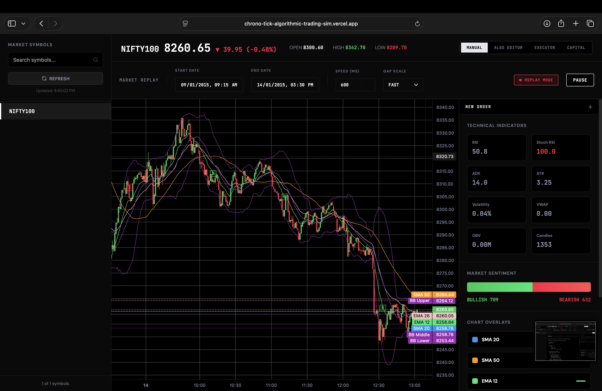
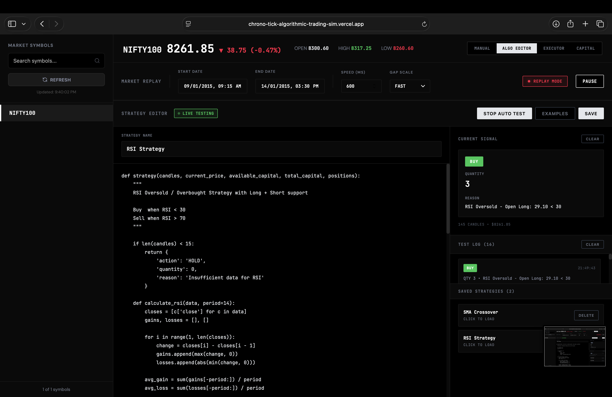
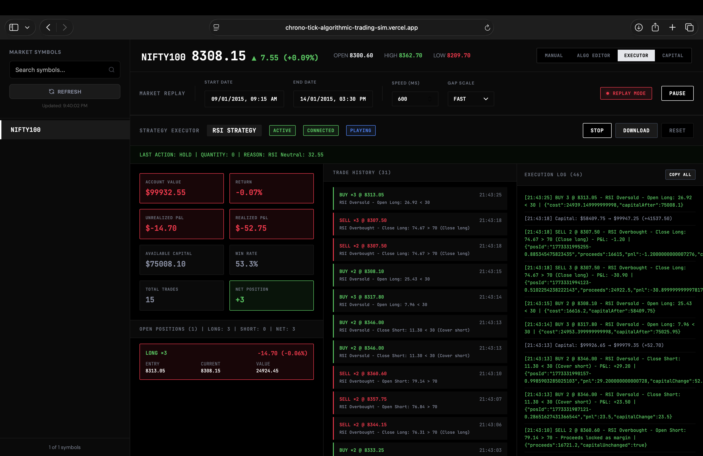

# ChronoTick - Market Replay and Algorithmic Trading Simulator

A sophisticated paper trading platform that allows you to replay historical market data and test trading strategies in a realistic environment. Built with React, TypeScript, and Python, this simulator supports both manual trading and algorithmic trading with comprehensive analytics and risk management.


---
## Things to keep in mind for the demo

1. Demo website: https://chrono-tick-algorithmic-trading-sim.vercel.app
2. The demo fronted is hosted on Vercel, backend is hosted on Render and the database of stocks is hosted on Supabase.
3. Currently, the demo website feauteres stock symbols: NIFTY50, NIFTY100, BANK NIFTY
4. All of the data for these are obtained from the kaggle website https://www.kaggle.com/datasets/debashis74017/nifty-50-minute-data
5. Other data can be added to the database to update the demo website by creating an open issue or you can fork and deploy this on your own on Render and Vercel.
6. Data exists from 2015-01-09 09:15:00 to 2026-01-22 12:45:00

## Features

### Market Replay
- **Historical Data Replay**: Stream historical market data with configurable speed
- **Real-time Candlestick Charts**: Professional-grade charting with Lightweight Charts
- **Time Controls**: Adjustable playback speed and gap scaling
- **WebSocket Streaming**: Live data updates with automatic reconnection

### Trading Capabilities

#### Manual Trading
- Market and limit order execution
- Stop-loss functionality
- Long and short position support
- Real-time P&L tracking
- Position and order management

#### Algorithmic Trading
- **Strategy Editor**: Write custom Python trading strategies
- **Live Testing**: Auto-test strategies with real-time market data
- **Pre-built Strategies**: SMA Crossover, RSI-based strategies
- **Strategy Library**: Save and load multiple strategies

#### Automated Execution
- **Strategy Executor**: Run algorithms with full position tracking
- **Risk Management**: Automatic margin calls and liquidation
- **Performance Analytics**: Win rate, drawdown, and return metrics
- **Trade History**: Complete audit trail with CSV export

### Technical Analysis
- **Moving Averages**: SMA (20, 50), EMA (12, 26)
- **Bollinger Bands**: Volatility-based bands
- **Technical Indicators**: RSI, Stochastic RSI, ADX, ATR, VWAP, OBV
- **Market Sentiment**: Bullish/bearish candle analysis
- **Volatility Metrics**: Real-time volatility tracking

### Advanced Features
- **Trade Markers**: Visual indicators on chart for executed trades
- **Capital Management**: Configure trading capital and risk parameters
- **Position Sizing**: Percentage-based position limits
- **Multi-symbol Support**: Trade across multiple instruments
- **Export Capabilities**: Download trade reports as CSV

---

## Quick Start

### Prerequisites

- **Node.js** 20.9 or higher
- **Python** 3.11.9
- **npm** or **yarn**
- Historical market data (CSV format)

### Installation

1. **Clone the repository**
   ```bash
   git clone https://github.com/PranavDarshan/ChronoTick-Algorithmic-Trading-Simulator
   cd ChronoTick-Algorithmic-Trading-Simulator
   ```

2. **Install frontend dependencies**
   ```bash
   cd frontend
   npm install
   ```

3. **Install backend dependencies**
   ```bash
   cd ../backend
   pip install -r requirements.txt
   ```

### Running the Application

1. **Start the backend server**
   ```bash
   cd backend
   pip install -r requirements.txt
   alembic upgrade head
   uvicorn app.main:app --reload
   ```
   Backend runs on `http://127.0.0.1:8000`

2. **Start the frontend development server**
   ```bash
   cd frontend
   npm run dev
   ```
   Frontend runs on `http://localhost:5173`

3. **Open your browser**
   Navigate to `http://localhost:5173`

---

## Documentation

- **[Usage Guide](USAGE.md)** - Comprehensive user manual with all features
- **[API Documentation](https://github.com/PranavDarshan/ChronoTick-Algorithmic-Trading-Simulator/blob/main/backend/API.md)** - Backend API reference 

---

## Project Structure

```
ChronoTick-Algorithmic-Trading-Simulator/
├── frontend/
│   ├── src/
│   │   ├── components/
│   │   │   ├── AlgoEditor.tsx       # Strategy development interface
│   │   │   ├── AlgoExecutor.tsx     # Strategy execution engine
│   │   │   ├── CapitalManager.tsx   # Capital & risk management
│   │   │   └── TopBar.tsx           # Control panel
│   │   ├── hooks/
│   │   │   └── useReplaySocket.ts   # WebSocket connection hook
│   │   ├── store/
│   │   │   └── replayStore.ts       # State management
│   │   ├── types/
│   │   │   └── market.ts            # TypeScript definitions
│   │   └── pages/
│   │       └── Dashboard.tsx        # Main application
│   ├── package.json
│   └── vite.config.ts
│
├── backend/
│   │
│   ├── app/
│   │   ├── api/
│   │   │   ├── algo_trading_backend.py
│   │   │   ├── data.py
│   │   │   ├── replay_ws.py
│   │   │   └── upload.py
│   │   │
│   │   ├── db/
│   │   │   ├── __init__.py
│   │   │   ├── base.py
│   │   │   ├── models.py
│   │   │   └── session.py
│   │   │
│   │   ├── services/
│   │   │   ├── replay_engine.py
│   │   │   └── test_replay_engine.py
│   │   │
│   │   ├── __init__.py
│   │   └── main.py
│   │
│   ├── alembic/
│   │   ├── versions/
│   │   ├── README
│   │   ├── env.py
│   │   └── script.py.mako
│   │
│   │
│   ├── alembic.ini
│   ├── requirements.txt
│   ├── market.db
│   ├── API.md
│   ├── WEBSOCKET_TESTING.md
│   └── README.md
│
├── USAGE.md                         # User guide
├── README.md                        # This file
└── LICENSE
```

---

## 🎮 Usage Overview

### 1. Select a Symbol
- Browse available symbols in the left sidebar
- Search or filter symbols
- Click to load historical data

### 2. Configure Replay
- Set start and end dates
- Adjust playback speed (1000-6000ms recommended)
- Choose gap scale (SLOW, MEDIUM, FAST, INSTANT)

### 3. Choose Trading Mode

#### **Manual Trading**
- Click "NEW ORDER" to place trades
- Set quantity, price, and stop loss
- Manage positions in real-time
- Track P&L continuously

#### **Algo Editor**
- Write custom Python strategies
- Test with live market data
- Save strategies for later use
- Load pre-built examples

#### **Executor**
- Load saved strategy
- Start automated execution
- Monitor performance metrics
- Download trade reports

#### **Capital Manager**
- Set initial capital
- Configure risk parameters
- View utilization statistics
- Update trading limits

---

## Example Strategy

Here's a simple RSI-based strategy:

```python
def strategy(candles, current_price, available_capital, total_capital, positions):
    """
    RSI Oversold/Overbought Strategy
    """
    if len(candles) < 15:
        return {
            'action': 'HOLD',
            'quantity': 0,
            'reason': 'Insufficient data for RSI'
        }
    
    # Calculate RSI
    def calculate_rsi(data, period=14):
        closes = [c['close'] for c in data]
        gains, losses = [], []
        for i in range(1, len(closes)):
            change = closes[i] - closes[i - 1]
            gains.append(max(change, 0))
            losses.append(abs(min(change, 0)))
        avg_gain = sum(gains[-period:]) / period
        avg_loss = sum(losses[-period:]) / period
        if avg_loss == 0:
            return 100
        rs = avg_gain / avg_loss
        return 100 - (100 / (1 + rs))
    
    rsi = calculate_rsi(candles)
    long_qty = sum(p['quantity'] for p in positions if p['side'] == 'BUY')
    
    # Buy when oversold
    if rsi < 30 and long_qty == 0:
        trade_value = available_capital * 0.25
        quantity = int(trade_value / current_price)
        if quantity > 0:
            return {
                'action': 'BUY',
                'quantity': quantity,
                'reason': f'RSI Oversold: {rsi:.2f} < 30'
            }
    
    # Sell when overbought
    elif rsi > 70 and long_qty > 0:
        return {
            'action': 'SELL',
            'quantity': long_qty,
            'reason': f'RSI Overbought: {rsi:.2f} > 70'
        }
    
    return {
        'action': 'HOLD',
        'quantity': 0,
        'reason': f'RSI Neutral: {rsi:.2f}'
    }
```

---

## Technologies Used

### Frontend
- **React 18** - UI framework
- **TypeScript** - Type safety
- **Vite** - Build tool
- **Lightweight Charts** - Professional charting library
- **Zustand** - State management
- **WebSocket API** - Real-time data streaming

### Backend
- **FastAPI** - Modern Python web framework
- **WebSockets** - Real-time communication
- **Pandas** - Data manipulation
- **Python 3.8+** - Strategy execution environment

---

## Configuration


### Frontend Configuration (`vite.config.ts`)

```typescript
export default defineConfig({
  server: {
    port: 5173,
    proxy: {
      '/api': 'http://127.0.0.1:8000',
      '/ws': {
        target: 'ws://127.0.0.1:8000',
        ws: true
      }
    }
  }
})
```

---

## Data Format

Historical market data should be in CSV format with the following columns:

```csv
symbol,timestamp,open,high,low,close,volume
NIFTY100,2015-01-09 09:15:00,100.50,101.25,100.25,101.00,1000000
NIFTY100,2015-01-09 09:16:00,101.00,101.50,100.75,101.25,1200000
...
```

The data must be added in the supabase database.

---

## Risk Management Features

### Automatic Safety Features
- **Stop Loss Execution**: Automatic position exit at specified price
- **Margin Call System**: 25% maintenance margin for short positions
- **Auto-Liquidation**: Forced position closure on margin call
- **Cooldown Period**: 30-second pause after liquidation
- **WebSocket Monitoring**: Auto-stop on connection loss
- **Capital Validation**: Prevents trades exceeding available capital

### Position Management
- **Long Positions**: Traditional buy-and-hold
- **Short Positions**: Margin-based short selling
- **Mixed Portfolios**: Simultaneous long and short positions
- **Priority Closing**: Smart order execution logic

---

## Performance Metrics

The simulator tracks comprehensive performance metrics:

- **Account Value**: Total equity (capital + unrealized P&L)
- **Total Return**: Percentage gain/loss from initial capital
- **Win Rate**: Percentage of profitable trades
- **Realized P&L**: Profit/loss from closed positions
- **Unrealized P&L**: Profit/loss from open positions
- **Sharpe Ratio**: Risk-adjusted returns *(planned)*
- **Maximum Drawdown**: Largest peak-to-trough decline *(planned)*

---

## Contributing

Contributions are welcome! Please follow these guidelines:

1. **Fork the repository**
2. **Create a feature branch** (`git checkout -b feature/amazing-feature`)
3. **Commit your changes** (`git commit -m 'Add amazing feature'`)
4. **Push to the branch** (`git push origin feature/amazing-feature`)
5. **Open a Pull Request**

### Development Guidelines
- Follow existing code style
- Add tests for new features
- Update documentation as needed
- Ensure all tests pass before submitting

---

## Known Issues

- Trade markers may need manual re-sync after extreme zoom operations
- Very high playback speeds (>10000ms) may cause UI lag
- Large datasets (>10,000 candles) may impact performance
- Browser storage limitations for saved strategies

---

## Roadmap

### Upcoming Features
- [ ] **Multi-timeframe Analysis**: Switch between 1m, 5m, 15m, 1h, 1d charts
- [ ] **Advanced Order Types**: OCO, trailing stop, iceberg orders
- [ ] **Portfolio Analysis**: Sharpe ratio, Sortino ratio, Calmar ratio
- [ ] **Strategy Backtesting**: Historical performance testing
- [ ] **Machine Learning Integration**: ML-based strategy suggestions
- [ ] **Cloud Storage**: Save strategies and data to cloud
- [ ] **Mobile Responsive**: Optimized mobile interface
- [ ] **Real-time Collaboration**: Share and collaborate on strategies
- [ ] **Extended Indicators**: MACD, Fibonacci, Ichimoku Cloud
- [ ] **Custom Alerts**: Price and indicator-based notifications

### Long-term Vision
- Integration with live market data feeds
- Strategy marketplace for sharing algorithms
- Social trading features
- Educational modules and tutorials
- API for external integrations

---

## ⚠️ Disclaimer

**This is a paper trading simulator for educational purposes only.**

- All trading is simulated with historical data
- No real money is involved
- Past performance does not guarantee future results
- This tool is not financial advice
- Use at your own risk
- Always consult with a licensed financial advisor before trading real money

---

## Screenshots

### Main Trading Interface


### Algo Editor


### Algo Executor
 

### For more images check out the assets folder.
---

## Getting Help

1. **Check the [Usage Guide](USAGE.md)** for detailed feature explanations
2. **Search [existing issues](https://github.com/PranavDarshan/ChronoTick-Algorithmic-Trading-Simulator/issues)** for similar problems
3. **Join our community** for discussions and support
4. **Create a new issue** if you can't find a solution

---

## Tips for New Users

1. **Start with Manual Mode**: Get familiar with the interface
2. **Use Pre-built Strategies**: Learn from working examples
3. **Test with Small Capital**: Start with conservative position sizes
4. **Enable Auto Test**: Validate strategies in real-time
5. **Monitor Execution Logs**: Understand what your strategy is doing
6. **Export Reports**: Analyze performance after each session

---

** Happy Trading! **

---

**Star ⭐ this repo if you find it helpful!**
